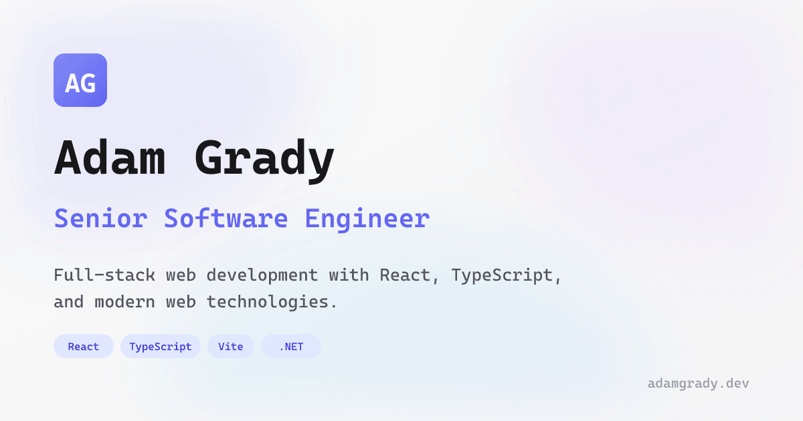

[](https://adamgrady.dev)

Personal portfolio website built with React 19, custom routing, auto-crawling SSG, and Cloudflare Workers - intentionally avoiding meta-frameworks like Next.js or Remix.

## Features

* **Custom Router** - Lightweight routing with View Transitions API support and dynamic route parameters
* **Auto-Crawling SSG** - Build-time static site generation that discovers routes automatically
* **SEO Optimized** - Dynamic meta tags, Open Graph images, Twitter Cards, and canonical URLs
* **Analytics** - Client-side session tracking, pageviews, and Core Web Vitals collection
* **AI Chat** - Per-project chat feature powered by Cloudflare AI (Llama 4)
* **Dual Mode UI** - Standard web view and terminal-style CLI interface

## Tech Stack

| Layer | Technology |
|-------|------------|
| Frontend | React 19 (canary), TypeScript, Tailwind CSS v4 |
| Build | Vite 7, MDX, React Compiler |
| Backend | Cloudflare Workers, Hono |
| Database | Cloudflare D1 (SQLite) |
| AI | Cloudflare AI |

## Getting Started

### Prerequisites

* Node.js 20+
* pnpm
* Cloudflare account (for Workers, D1, and AI)

### Installation

```bash
# Clone the repository
git clone https://github.com/BlueFrog130/portfolio.git
cd portfolio

# Install dependencies
pnpm install
```

### Development

```bash
# Start development server
pnpm dev
```

This starts Vite with the Cloudflare plugin, providing hot reload for both client and worker code.

### Build

```bash
# Full production build (client + server + SSG)
pnpm build

# Preview production build
pnpm preview
```

### Database Setup

Create a D1 database and run migrations:

```bash
# Create the database
npx wrangler d1 create portfolio-analytics

# Run migrations
npx wrangler d1 migrations apply portfolio-analytics
```

Update `wrangler.jsonc` with your database ID.

## Project Structure

```
src/
├── lib/
│   ├── analytics/     # Client-side analytics (sessions, pageviews, web vitals)
│   ├── chat/          # AI chat utilities
│   ├── components/    # Shared components
│   ├── content/       # Content loading utilities
│   ├── mode/          # Portfolio mode context (web vs terminal)
│   ├── router/        # Custom client-side router
│   ├── data.ts        # Resume data
│   └── head.ts        # SEO meta tag generation
├── content/
│   └── projects/      # MDX project files with metadata
├── pages/
│   ├── +Page.tsx      # Home page
│   ├── 404/           # 404 page
│   ├── project/[slug]/ # Dynamic project pages
│   └── terminal/      # Terminal mode
├── routes.ts          # Route definitions
├── App.tsx            # Root app component
├── main.tsx           # Client entry point
└── entry-server.tsx   # SSG entry point
worker/
└── index.ts           # Cloudflare Worker (Hono API)
scripts/
└── ssg.ts             # Auto-crawling SSG build script
migrations/            # D1 database migrations
```

## Architecture

### Static Site Generation

The SSG system uses an auto-crawling approach:

1. Renders the root page server-side
2. Extracts internal links from rendered HTML
3. Recursively renders discovered pages
4. Generates optimized module preloads per route
5. Injects SEO metadata into static HTML

### Analytics

Client-side analytics tracks:

* **Sessions** - Device, browser, OS, screen size, referrer, UTM params
* **Pageviews** - Path, duration, navigation flow
* **Web Vitals** - LCP, FID, CLS, INP, FCP, TTFB
* **Custom Events** - Extensible event tracking

Events are batched and sent via Beacon API for reliable delivery.

### API Routes

The Cloudflare Worker provides:

* `POST /api/analytics` - Batch analytics events
* `POST /api/chat/projects/:slug` - AI chat for project pages

## Deployment

Deploy to Cloudflare:

```bash
npx wrangler deploy
```

The build outputs to:

* `dist/client/` - Client bundle
* `dist/server/` - Worker bundle
* `dist/static/` - Final SSG output (deployed as static assets)

## Scripts

| Command | Description |
|---------|-------------|
| `pnpm dev` | Start development server |
| `pnpm build` | Production build with SSG |
| `pnpm preview` | Preview production build |
| `pnpm format` | Format code with Prettier |
| `pnpm format:check` | Check code formatting |
| `pnpm generate:og` | Generate OG images |

## License

MIT
